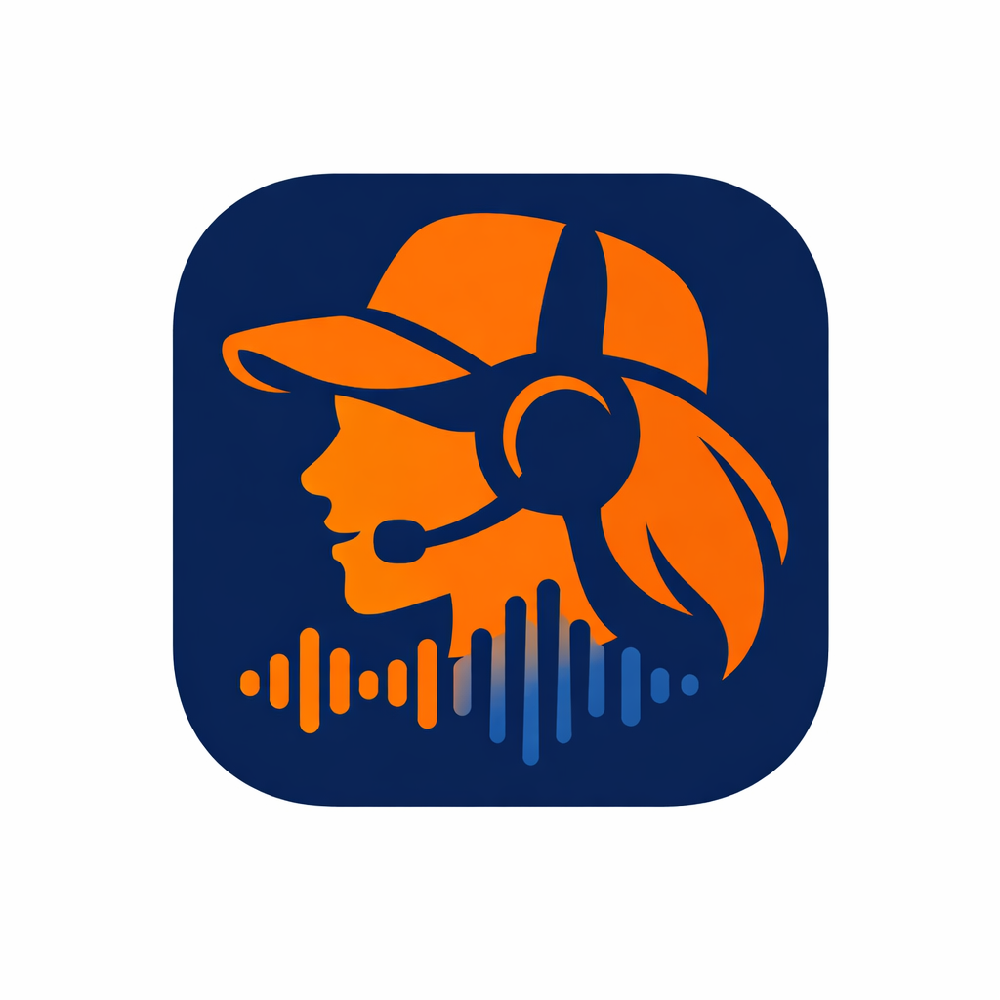
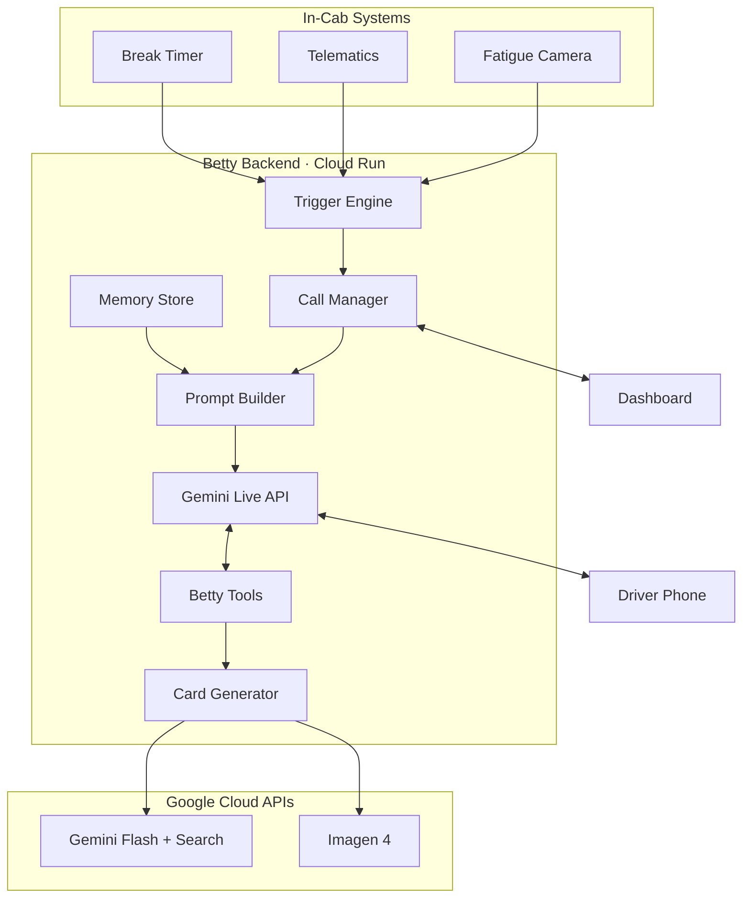

<p align="center">
  
</p>

# Betty — AI Voice Companion for Truck Drivers

> Proactive AI that calls truck drivers when safety systems detect fatigue, erratic driving, or approaching break limits. Real conversations that save lives.

Built for the [Gemini Live Agent Challenge](https://geminiliveagentchallenge.devpost.com/) hackathon.

**[Live Demo](https://bettyai.klassicstudios.com/)** · **[Dashboard](https://bettyai.klassicstudios.com/dashboard)** · **[DevPost Submission](https://geminiliveagentchallenge.devpost.com/)**

---

## The Problem

Australia's trucking industry loses lives every year to driver fatigue. Fatigue cameras and telematics systems detect danger — but they rely on fleet managers to act on alerts. That doesn't scale. A supervisor can't monitor hundreds of drivers 24/7.

## The Solution

Betty picks up the phone and calls the driver directly. She has a real, natural voice conversation — checking in, gauging how they're feeling, suggesting rest stops, and escalating to management if needed. She remembers previous calls within the shift and adapts her tone to the driver's mood.

---

## Architecture



See [docs/architecture.mmd](docs/architecture.mmd) for the full detailed diagram.

### Call Flow

1. **Safety event** (fatigue camera, telematics, break limit) → Trigger Engine
2. **Risk scoring** (0-1) with type-specific modifiers and consecutive event escalation
3. **Call initiated** → WebSocket notification to driver's browser
4. **Driver accepts** → Browser audio bridges to Gemini Live session via WebSocket
5. **Betty converses** using system prompt with trigger context + memory from prior calls
6. **Tool calls** mid-conversation — check hours, look up events, send rest stop cards, escalate
7. **Call ends** → transcript preserved, conversation summary encrypted to memory

### Two-Session Simulation

For demos, Betty and a simulated driver persona run as **two parallel Gemini Live sessions**. Audio is resampled (24kHz ↔ 16kHz) and streamed between them in real-time. No microphone needed — just click and watch a full conversation unfold.

---

## Features

- **Proactive calling** — Betty calls the driver, not the other way around
- **Real-time voice** — Bidirectional audio via Gemini Live API with Aoede voice
- **Fatigue camera vision** — Video frames extracted and sent to Gemini so Betty can see drowsy eyes, yawning, head nods
- **Cross-call memory** — AES-256-GCM encrypted per-driver memory with 14-hour TTL. Betty remembers prior conversations within the shift
- **Visual cards** — Rest stop recommendations (Gemini Flash + Search + Imagen 4 backgrounds), shift wellness summaries, incident reports
- **Smart escalation** — If the driver refuses to rest, Betty escalates to the fleet manager with an incident report card
- **Risk scoring** — Events scored 0-1 with type modifiers, severity weighting, and consecutive event escalation
- **Natural interruptions** — Simulated drivers cut Betty off mid-sentence with realistic barge-in; Betty adapts naturally
- **Live mic mode** — Talk to Betty directly from the dashboard using your microphone with answer/decline call flow
- **Personalised name** — Enter your name and Betty uses it throughout the conversation
- **Driver personas** — Configurable mood, situation, and resistance level for simulation
- **Cabin noise** — Continuous in-cab road noise mixed into audio for realism
- **Live transcription** — Real-time conversation text on the dashboard with input audio transcription

### Betty's Tools (function calling mid-conversation)

| Tool | What it does |
|------|-------------|
| `get_driver_hours` | Check continuous hours, break deadline, nearest rest area |
| `get_recent_events` | Look up recent fatigue/driving events |
| `escalate_to_manager` | Alert fleet manager + generate incident card |
| `send_rest_stop_card` | Send visual rest stop recommendation to driver's screen |
| `assess_driver_mood` | Log emotional state assessment for memory |
| `log_conversation_summary` | Save call summary to encrypted memory |

---

## Try It Live (No Setup Required)

The fastest way to test Betty:

1. **Open the Interactive Demo** → [bettyai.klassicstudios.com](https://bettyai.klassicstudios.com/)
2. Enter your name — Betty will use it during conversations
3. Follow the 6-page guided walkthrough — each page triggers a real Gemini Live API call
4. No microphone needed — a simulated AI driver responds automatically

Or explore the **Fleet Manager Dashboard** → [bettyai.klassicstudios.com/dashboard](https://bettyai.klassicstudios.com/dashboard) — switch to Live Mic mode to talk to Betty directly

---

## Reproducible Testing — Run It Yourself

### Prerequisites

- Python 3.12+
- A [Gemini API key](https://aistudio.google.com/apikey)

### Step 1: Clone and install

```bash
git clone https://github.com/KlassicStudiosPtyLtd/TruckDriverLiveAgent.git
cd TruckDriverLiveAgent

python -m venv .venv
source .venv/bin/activate  # Linux/Mac
# .venv\Scripts\activate   # Windows

pip install -r requirements.txt
```

### Step 2: Set environment variables

```bash
export GEMINI_API_KEY=your-key-here
export BETTY_MEMORY_KEY=any-random-secret-string-here
```

### Step 3: Run unit tests (no API key needed)

```bash
pytest tests/unit/ -v
```

This runs 119 tests covering trigger risk scoring, system prompt building, AES-256-GCM encryption, memory store CRUD, call lifecycle state machine, config validation, and video frame path resolution. All tests run offline with no external dependencies.

### Step 4: Start the server

```bash
python -m src.main
```

### Step 5: Test in the browser

| URL | What to test |
|-----|-------------|
| `http://localhost:8000/` | **Interactive Demo** — 6-page guided walkthrough with live API calls. Start here. |
| `http://localhost:8000/dashboard` | **Dashboard** — Select a driver, send a fatigue event, watch Betty call and converse in real-time. Switch to Live Mic mode to talk to Betty directly. Try the Shift Simulation for a compressed 14-hour shift with multiple events. |
| `http://localhost:8000/static/driver.html?id=DRV-001` | **Driver Phone** — See what the driver sees. Open alongside the dashboard in a second tab. |

### Step 6: Things to try

1. **Single call** — On the dashboard, select a driver, choose "Droopy Eyes" + "High" severity, click "Send Fatigue Event". Watch Betty call, converse, and potentially suggest a rest stop.
2. **Cross-call memory** — Trigger a second event for the same driver. Betty will reference the previous conversation.
3. **Shift simulation** — Click "Start Shift Simulation" with 5 events. Betty handles escalating triggers across multiple calls with continuous memory.
4. **Card generation** — Use the Card Generator panel to create rest stop cards (uses Gemini Flash + Google Search + Imagen 4), wellness summaries, and incident reports.
5. **Driver calls Betty** — Click "Driver Calls Betty" to test the inbound call flow where the driver initiates.
6. **Live mic mode** — On the dashboard, switch to "Live Mic (You Talk)" mode, enter your name, trigger an event, click Answer when Betty calls, and have a real conversation.
7. **Natural interruptions** — In the demo, try the "Natural Interruption" step to see a grumpy driver cut Betty off mid-sentence.

### Step 7: Integration tests (requires API key)

```bash
# Automated two-session conversation — Betty + simulated driver talk to each other
python tests/test_conversation.py

# Simulated call with fatigue camera video frames sent to Gemini
python tests/test_video_call.py

# Card generation test
python tests/test_cards_call.py
```

### Step 8: Live mic test (optional, requires microphone + speakers)

```bash
# Talk to Betty directly with your mic
python tests/test_voice.py
```

---

## Deploy to Cloud Run

### Using PowerShell (Windows)

```powershell
$env:GEMINI_API_KEY = "your-key-here"
.\deploy.ps1
```

### Using Bash

```bash
export GEMINI_API_KEY=your-key-here
bash deploy.sh
```

The deploy script automates the full process: build container via Cloud Build → push to Artifact Registry → deploy to Cloud Run with environment variables, autoscaling, session affinity, and memory/CPU config. Single command deployment.

### Automated Deployment Files

| File | Purpose |
|------|---------|
| [deploy.ps1](deploy.ps1) | PowerShell deployment script — Cloud Run |
| [deploy.sh](deploy.sh) | Bash deployment script — Cloud Run |
| [Dockerfile](Dockerfile) | Container definition (Python 3.12-slim) |
| [.github/workflows/ci.yml](.github/workflows/ci.yml) | GitHub Actions CI/CD — unit tests on every push, integration tests on main |

- Builds a Docker container via Cloud Build
- Deploys to Cloud Run with session affinity (for WebSocket call continuity)
- Scales 0-3 instances, 512MB memory, 10-minute timeout
- CI pipeline runs 119 unit tests automatically on every push
- Estimated cost: < $10 for the entire hackathon period

---

## Project Structure

```
src/
  main.py                  # FastAPI app, routes, WebSocket endpoints
  voice/
    prompts.py             # System prompt builder with dynamic context
    gemini_live.py         # Gemini Live API session wrapper
  call/
    call_manager.py        # Call lifecycle (pending → active → ended)
    ws_handler.py          # Browser ↔ Gemini audio bridge
    simulated_call.py      # Two-session simulation engine
    video_frames.py        # OpenCV frame extraction from fatigue videos
  tools/
    betty_tools.py         # Tool declarations + async handlers
  triggers/
    trigger_engine.py      # Risk scoring + call initiation
    break_timer.py         # Periodic break limit checker
  memory/
    store.py               # Encrypted SQLite memory with TTL
    crypto.py              # AES-256-GCM + HKDF per-driver keys
  cards/
    renderer.py            # Pillow card rendering utilities
    rest_stop_card.py      # Rest stop cards (Search + Imagen)
    wellness_card.py       # Shift wellness summary cards
    incident_card.py       # Incident report cards
  data/
    mock_fleet.py          # Mock driver profiles, hours, events

static/
  dashboard.html/js        # Fleet manager dashboard (simulated + live mic modes)
  driver.html/js           # Driver phone interface
  demo.html/js/css         # Interactive demo walkthrough
  audio-processor.js       # AudioWorklet for mic capture + client-side VAD
  tutorial.js/css          # Dashboard guided tour
  style.css                # Shared styles
  sfx/                     # Sound effects (ring, end call, cabin noise)
  cards/                   # Generated PNG cards

config/
  betty.yaml               # Personality, escalation, triggers, Gemini config

data/
  mock/
    sample_data.json       # Driver profiles, vehicles, rest areas
    driver_personas.json   # Simulation personas
    videos/                # AI-generated fatigue camera footage (VEO)

tests/
  unit/                    # 119 unit tests (no API key needed)
  test_conversation.py     # Automated two-session integration test
  test_voice.py            # Live mic test
  test_video_call.py       # Video frame injection test
  test_cards_call.py       # Card generation test
```

---

## Configuration

All configuration lives in `config/betty.yaml`:

| Section | Key settings |
|---------|-------------|
| **Personality** | Name, voice (Aoede), greeting style |
| **Memory** | Cross-call enabled, 14-hour duration |
| **Escalation** | Announced/silent mode, fatigue refusal threshold |
| **Break alerts** | Warning threshold (30 min), reminder interval |
| **Call** | Max duration (15 min), min time between calls, ring timeout |
| **Triggers** | Auto-call flags per event type |
| **Gemini** | Model, voice, API key env var |

Environment variables:
- `GEMINI_API_KEY` (required) — Google AI Studio API key
- `BETTY_MEMORY_KEY` (required for memory) — any random string for encryption

---

## Built With

- **Gemini Live API** — Real-time bidirectional voice
- **Gemini Flash + Google Search Grounding** — Rest stop location descriptions
- **Imagen 4** — Scenic rest stop card backgrounds
- **Google VEO** — Simulated fatigue camera footage
- **Google Cloud Run** — Serverless deployment
- **Google GenAI SDK** — Session management + function calling
- **FastAPI + WebSockets** — Server and real-time communication
- **SQLite + AES-256-GCM** — Encrypted per-driver memory
- **Pillow** — Visual card rendering
- **OpenCV** — Video frame extraction
- **Web Audio API** — Browser audio capture and playback

---

## License

This project was built for the Gemini Live Agent Challenge hackathon.
